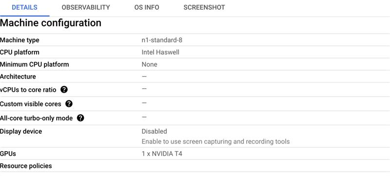

# PMC-Patients

Machine Configuration used is 

Because of low compute could nt take to completion
Local Lama also compute was not suffice
But as such finetuning biobert (transformer based)  and biomistral (peft + lora + model garden)  for ner data wget http://nlp.dmis.korea.edu/projects/biobert-2020-checkpoints/datasets.tar.gz -O should help us in achieving the task of building knowledge graph and able push in FHIR(json) /OMOP (sql) structure

